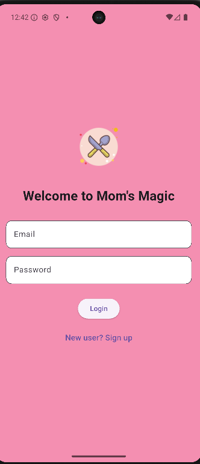
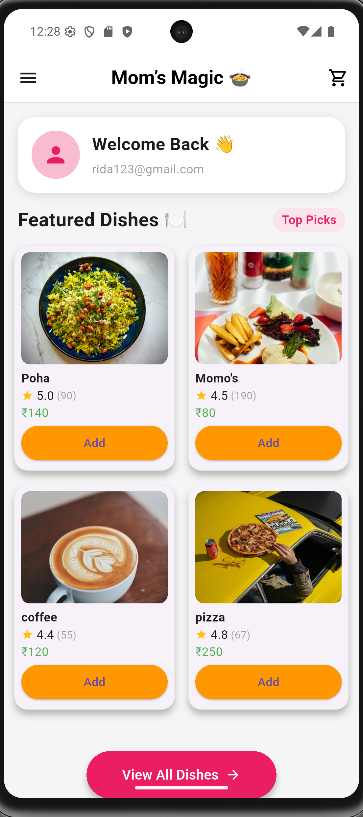
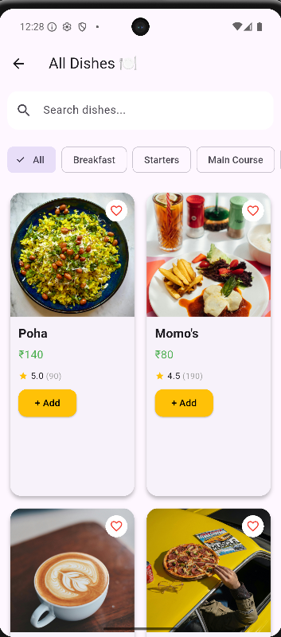
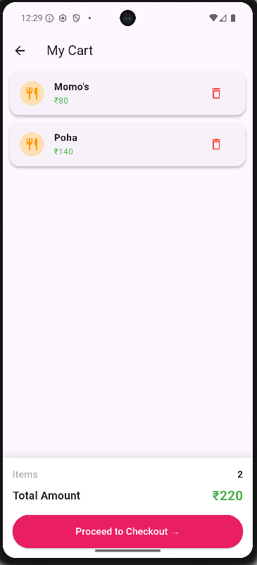
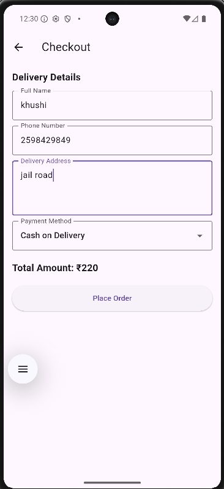
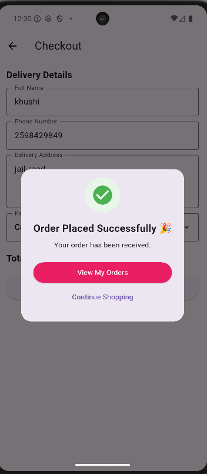
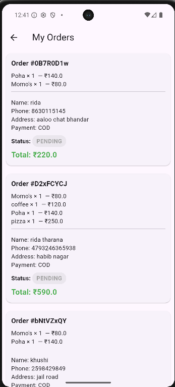

# 🍲 Mom's Magic

A modern Flutter-based food delivery application that allows users to browse dishes, search meals, manage carts, place orders, and track their order history through an intuitive and responsive interface.

---

## 📱 Overview

Mom's Magic is a food delivery application built using Flutter and Firebase. The app focuses on providing a smooth user experience for discovering homemade food, managing orders, and completing the checkout process.

---

## ✨ Features

### 🔐 Authentication
- User Registration
- User Login
- Firebase Authentication
- Persistent User Sessions

### 🏠 Home Screen
- Featured Dishes Section
- User Welcome Card
- Navigation Drawer
- Quick Access to Menu

### 🍽️ Food Browsing
- View All Dishes
- Category Filtering
- Dish Search Functionality
- Dish Details Page

### 🛒 Cart Management
- Add Items to Cart
- Remove Items from Cart
- Dynamic Price Calculation
- Empty Cart Handling

### 📦 Order System
- Checkout Flow
- Delivery Information Collection
- Cash on Delivery Support
- Order Confirmation Dialog
- Order History Tracking

### 📊 Order Tracking
- View Previous Orders
- Order Status Display
- Status Indicators
- Order Summary

### 🎨 User Interface
- Clean Material Design UI
- Responsive Layout
- Card-Based Design
- Category Chips
- Search Bar
- Improved Navigation Experience

---

## 🛠️ Tech Stack

### Frontend
- Flutter
- Dart

### Backend
- Firebase Authentication
- Cloud Firestore

### State Management
- Provider

### Development Tools
- Android Studio
- Git
- GitHub

---

## 📂 Project Structure

```text
lib/
├── auth/
│   └── auth_gate.dart
│
├── models/
│   └── dish.dart
│
├── pages/
│   ├── homepage.dart
│   ├── dishespage.dart
│   ├── dish_detail_page.dart
│   ├── cartpage.dart
│   ├── checkoutpage.dart
│   ├── my_orders_page.dart
│   ├── admin_orders_page.dart
│   ├── loginpage.dart
│   └── signup_page.dart
│
├── providers/
│   └── cart_provider.dart
│
├── services/
│   ├── auth_service.dart
│   ├── dish_service.dart
│   ├── location_service.dart
│   └── order_service.dart
│
├── widgets/
│   └── dish_card.dart
│
├── firebase_options.dart
└── main.dart
```

---

## 🚀 Getting Started

### Clone Repository

```bash
git clone https://github.com/khushi08singh/Moms_Magic.git
```

### Navigate to Project

```bash
cd Moms_Magic
```

### Install Dependencies

```bash
flutter pub get
```

### Run Application

```bash
flutter run
```

---

## 🔥 Firebase Configuration

This project uses Firebase Authentication and Cloud Firestore.

Before running the application:

1. Create a Firebase Project.
2. Enable Authentication.
3. Enable Cloud Firestore.
4. Configure FlutterFire.
5. Add Firebase configuration files.

Run:

```bash
flutterfire configure
```

---

## 📸 Application Screens

- Login Screen
- Sign Up Screen
- Home Screen
- All Dishes Screen
- Dish Details Screen
- Cart Screen
- Checkout Screen
- My Orders Screen

## 📸 Application Screens

### Login Screen



---

### Home Screen



---

### All Dishes



---

### Cart



---

### Checkout



---

### Order Success



---

### My Orders




---

## 🎯 Key Functionalities

- User Authentication
- Food Discovery
- Category Filtering
- Search Functionality
- Cart Management
- Order Placement
- Order Tracking
- Firebase Integration

---

## 🔮 Future Enhancements

- Wishlist / Favorites
- Online Payment Gateway
- Real-Time Order Tracking
- Push Notifications
- User Profile Management
- Ratings & Reviews
- Location-Based Delivery Tracking

---

## 👩‍💻 Developer

**Khushi Singh**

B.Tech – Computer Science & Engineering (AI)

Flutter Developer

GitHub: https://github.com/khushi08singh

---

## 📜 License

This project is developed for learning, portfolio, and placement purposes.

---

⭐ If you like this project, consider giving it a star.
